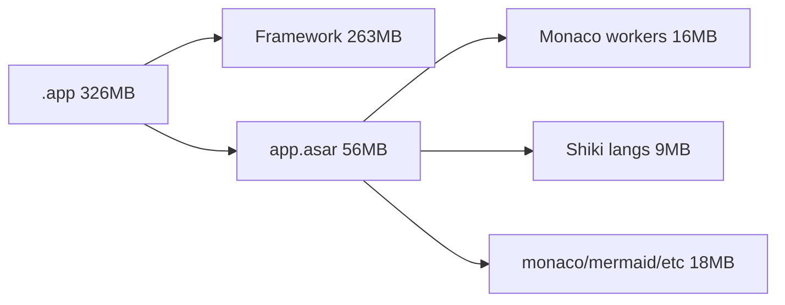

# 前端资源再瘦身（待执行）

> 状态：**暂缓**，先记录，以后再执行。  
> 背景：上一轮已剥离 Claude/Codex 捆绑 CLI、把 renderer-only 依赖挪到 `devDependencies`、收紧 electron-builder 排除规则；DMG 已从 ~253MB 降到 ~113MB。

## 判断

**还有优化空间，但性价比已经下降。**

arm64 实测（v0.1.0，约 2026-08-04）：

| 产物 | 大小 | 说明 |
|------|------|------|
| DMG | ~113MB | 安装包，已可接受 |
| ZIP | ~124MB | 更新/分发包 |
| `.app` | ~326MB | 安装后体积 |
| └ Electron Framework | ~263MB | 约 80%，短期难砍 |
| └ `app.asar` | ~56MB | 业务 + 前端资源 |
| └ `app.asar.unpacked` | ~6MB | better-sqlite3 / node-pty |

可控部分约 **63MB**，大头在 renderer **~48MB**。本期只动可控、低风险的前端资源；不碰 Electron 底座，也不再动 Claude/Codex 策略。



## 待办

- [ ] **trim-monaco-workers**：`monacoWorkers` 只保留 `editor.worker`，并从 `main` 入口改为 Monaco 懒加载路径
- [ ] **trim-shiki-langs**：通过 Vite alias / 显式 langs 收紧 Shiki 全量语言包，对齐 `MONACO_LANGUAGES`
- [ ] **verify-size**：`build:mac` + `report:size`，冒烟 Diff / 代码块 / Mermaid / KaTeX

## 选定做法

### 1. 砍掉多余 Monaco language workers（主收益）

**语言服务是什么：** Monaco 的 `ts.worker` / `json.worker` 等提供补全、诊断、悬停文档、跳转定义等 IDE 能力。预览 / Diff / 聊天代码块高亮通常只需要 `editor.worker`，不需要完整语言服务。

现状：

- [`apps/desktop/src/renderer/src/utils/monacoWorkers.ts`](../apps/desktop/src/renderer/src/utils/monacoWorkers.ts) 在 [`main.ts`](../apps/desktop/src/renderer/src/main.ts) 入口静态引入
- 打进全部 workers，其中 **`ts.worker` 单独 ~12MB**，五个 workers 合计 **~16MB**

改动：

1. `monacoWorkers.ts` 只保留 `editor.worker`，所有 label 都走它
2. 将 `import '@renderer/utils/monacoWorkers'` 从 `main.ts` 挪到 Monaco 真正加载路径（[`monacoBootstrap.ts`](../apps/desktop/src/renderer/src/utils/monacoBootstrap.ts) / `loadMonaco`），避免冷启动也解析 worker 入口
3. 与 `stream-monaco` 自带的 `ensureMonacoWorkers` 协调：保留我们提前设置的 `MonacoEnvironment`，避免它再拉全量 worker URL

预期：安装后约 **-15MB**；DMG 压缩后大约 **-4~6MB**。

### 2. 收紧 Shiki 语言包（次收益）

现状：`out/renderer/assets` 里约 **324 个** TextMate 语言 chunk（含 emacs-lisp / wolfram 等），合计 **~9MB**。根因是 `stream-monaco` 从 `shiki` 主入口 `createHighlighter`，Vite 会把全量 lang 动态模块都打进产物。

改动：

1. 优先：Vite `resolve.alias` 把 `shiki` 指到更小入口（如 `shiki/bundle/web`），或仅打包 [`monaco.ts`](../apps/desktop/src/renderer/src/utils/monaco.ts) 的 `MONACO_LANGUAGES` + 常见 chat 语言
2. 同步确认 `registerMonacoThemes(..., MONACO_LANGUAGES)` / markstream `preloadCodeBlockRuntime` 不会再拉全量
3. 验证：冷门语言代码块降级为 plaintext；常见语言（js/ts/py/go/rust/json/md/shell 等）高亮正常

预期：安装后约 **-6~9MB**；DMG 大约 **-2~3MB**。

### 3. 不做 / 明确放弃

- **Electron Framework**：无解（除非换 Tauri 等，另开项目）
- **移除 mermaid / katex / monaco 本体**：功能回退太大
- **再抠 better-sqlite3 / SDK 几 MB**：收益 &lt;1–4MB，不值得单独一轮

### 4. 验证

```bash
pnpm -C apps/desktop build:mac
pnpm -C apps/desktop report:size
```

对比：`app.asar`、workers 是否消失、shiki lang 文件数量。  
冒烟：Diff 编辑器、聊天代码块高亮、Mermaid、KaTeX。

## 预期结果

| 指标 | 现在 | 目标（约） |
|------|------|------------|
| `.app` | 326MB | **300–310MB** |
| DMG | 113MB | **105–110MB** |
| Framework | 263MB | 不变 |

若目标是「安装后明显小于 260MB」，本期做不到；需要换运行时。

## 相关已落地改动（上一轮）

- renderer-only 依赖移入 `devDependencies`，避免 asar 双重打包
- [`electron-builder.yml`](../apps/desktop/electron-builder.yml) / [`electron-builder.release.yml`](../apps/desktop/electron-builder.release.yml)：`compression: maximum`、排除 CLI 平台包与 sqlite 中间产物
- [`scripts/after-pack.cjs`](../apps/desktop/scripts/after-pack.cjs)：裁剪 node-pty 跨平台 prebuilds
- [`scripts/report-pack-size.mjs`](../apps/desktop/scripts/report-pack-size.mjs)：`pnpm report:size`
- Claude / Codex 改为依赖本机 CLI，不再捆绑平台二进制
